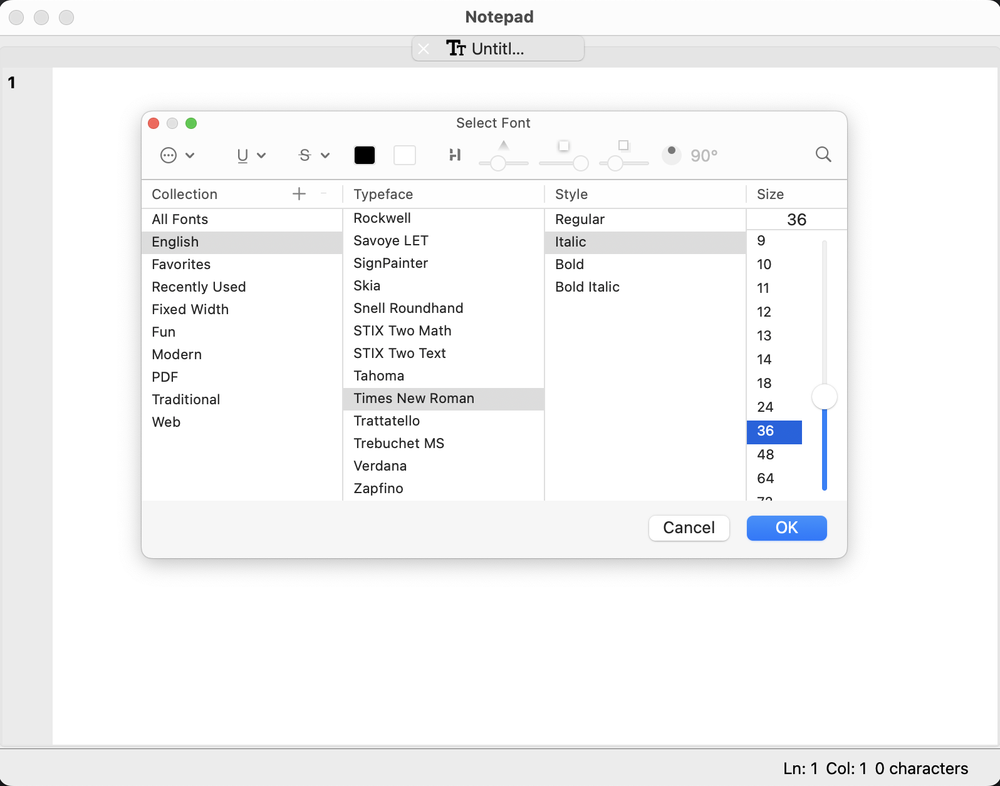
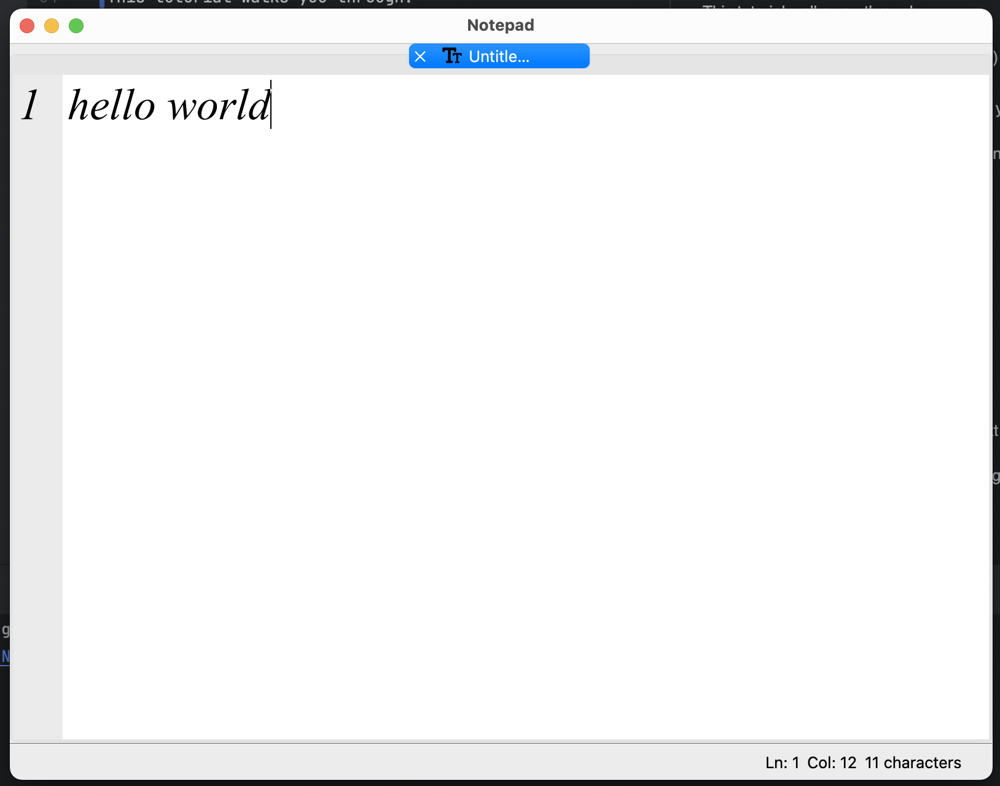

# 📝 Ninja Notepad

---

A modern Notepad-like text editor built with **PySide6 (Qt for Python)**.
Ninja Notepad supports multiple tabs, custom file format **(.njtext)**, and advanced editing **features like Find, Go To Line, Word Wrap, Zoom, and Status Bar tracking**. 

It can run in any OS Ubuntu, Windows, MacOS.

## 🚀 Features

---

* 📂 Open, Save, Save As, and Save All
* 🗂️ Multi-tab editing support
* 🔎 Find & Replace panel
* ⏩ Go To Line functionality
* ⌨️ Undo, Cut, Copy, Paste, Delete, Select All
* 🕒 Insert Date & Time
* 🔡 Zoom In, Zoom Out, Restore Zoom
* 📑 Line numbers & Column indicator in Status Bar
* 🖨️ Print support
* 📝 Supports .njtext (Ninja Notepad format) and (.txt) files


## 🛠️ Installation

---

### Prerequisites
* Python 3.9+
* Pipenv (recommended) or pip

### Setup (with Pipenv)

```bash
git clone https://github.com/shivangi-2001/Notepad.git
cd Notepad
pipenv install
pipenv shell
python main.py
```

### Setup (with pip)

```bash
git clone https://github.com/shivangi-2001/Notepad.git
cd Notepad
pip install -r requirements.txt
python main.py
```


## 🖥️ Run as a Local Desktop Application

---

If you want Ninja Notepad to behave like a native desktop app (with its own launcher, icon, and menu entry), you can follow this guide:

[👉 Creating a Local Desktop Application for Ubuntu (Medium)](https://medium.com/@meetwithIT/creating-a-local-desktop-application-for-ubuntu-33efb2f15b48)

This tutorial walks you through:

* Adding a desktop entry (.desktop file)
* Setting the application icon 
* Running Ninja Notepad directly from your OS menu

(Works on Ubuntu/Linux – for Windows and macOS, steps differ and will be added in future updates.)

## 📸 Video

---

Run the video in the github file to view, how it works.🤩

[](notepad.mp4)

Please let me ✌🏻 know your feedback in email: ***shivangikeshri21@gmail.com***

## 📦 File Format

---

Ninja Notepad introduces a custom .njtext format and .txt format.

This is a plain-text format but helps distinguish files created with Ninja Notepad from regular .txt files.


## 👨‍💻 Author

--- 

Developed by **Shivangi Keshri** ✨

---
⚡ Happy Coding with Ninja Notepad!
